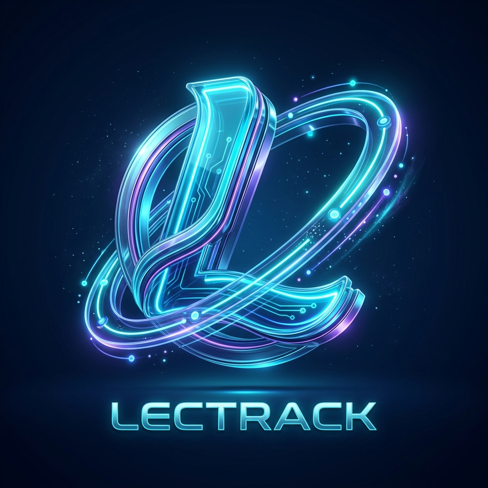

  
  <h1>🏛️ LecTrack | Next-Gen Institutional Learning Portal</h1>
  
<strong>A Premium Academic Ecosystem by Fountains Data Technology</strong>

---

LecTrack is a cutting-edge, high-end academic ecosystem meticulously engineered to bridge the digital gap between lecturers and students. By combining real-time Firebase database orchestration with elite, glassmorphic UI/UX animations, LecTrack provides an unparalleled, immersive environment for information delivery, real-time performance tracking, and institutional community building.

## 🚀 Key Features

### 🎓 Dynamic Academic Hub
- **Periodical Modules:** A highly responsive lecture delivery system built to stream content and assignments instantly.
- **Speedometer Grading:** Real-time, interactive academic scoring with visual gauges that mathematically track student performance.
- **Instant Broadcasting:** Lecturers can push live, real-time broadcast messages and notifications that seamlessly break down and format intelligently on student screens.

### 🔐 Elite Security & Identity
- **Multi-Layered Auth:** Secure gating utilizing Unique Student IDs, Passkeys, and Google OAuth via Firebase.
- **Persistent AI Avatars:** A built-in mathematical engine that generates globally unique avatars based on advanced time-stamped seeds, automatically syncing across all devices and Firebase Firestore.
- **Smart Google Protection:** Intelligent logic that locks avatar modification if a student attempts to override their authenticated Google profile picture.

### 📱 Progressive Web App (PWA) Engine
- **Universal Install Fallback:** Aggressive standalone display checking that ensures users are elegantly prompted to install the app natively on Windows, Android, and iOS.
- **True Offline Capability:** A robust background Service Worker (`sw.js`) that caches all essential HTML, CSS, JavaScript, and graphical assets, allowing the app to open and function flawlessly even with zero internet connection.
- **Smart Connection Monitoring:** Real-time JavaScript monitoring that seamlessly slides down a sleek red warning banner the exact millisecond a device loses internet connection.

### ✨ Immersive UI/UX & Design Architecture
- **Equalizer Wave Typography:** Next-generation CSS mathematical animations that cascade individual letters in the LecTrack logo to mimic a live music equalizer.
- **Dynamic Favicon Notification:** An HTML5 Canvas engine that injects live red notification bubbles directly into the browser's favicon/tab icon.
- **Fluid Glassmorphism:** Deeply blurred backgrounds, glowing cyan borders, and smooth scaling transitions that deliver a premium, high-end aesthetic across every pixel.

---

## 🛠️ Technology Stack
- **Frontend:** HTML5, Vanilla JavaScript (ES6+), Advanced CSS3 (Variables, Flexbox, CSS Animations)
- **Backend/Database:** Google Firebase (Authentication, Firestore, Realtime Database)
- **Design System:** Custom Glassmorphic Component Library, Font Awesome 6
- **Architecture:** Single Page Application (SPA) functionality with PWA caching protocols.

## ⚙️ Setup & Installation
1. Clone the repository.
2. Launch a local server (e.g., VS Code Live Server or Python HTTP Server) to ensure Service Workers operate correctly.
3. Open `index.html` to experience the landing page, or authenticate to access the core `home.html` dashboard.

---

  <i>Developed with precision by <b>Fountains Data Technology</b>. Delivering the future of academic management.</i>

